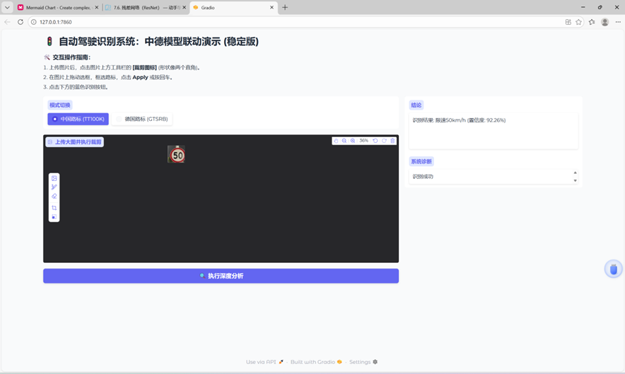
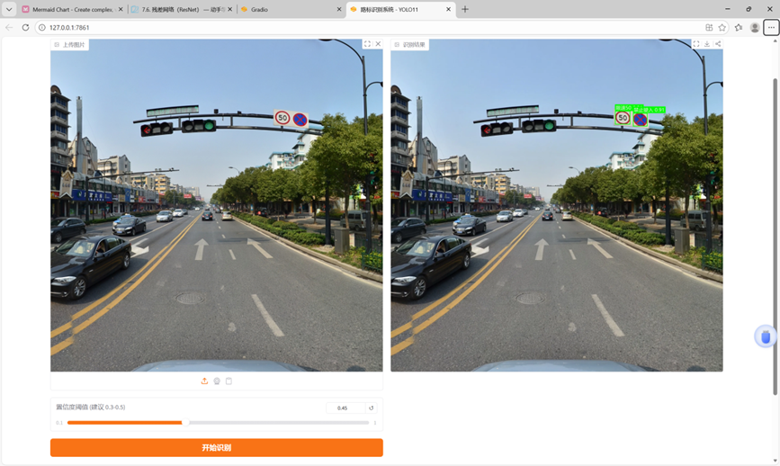

# YOLO11 Chinese Traffic Sign Detection

A Chinese traffic sign detection project based on **YOLO11** and the **TT100K** dataset.  
This repository includes dataset conversion, model training, result visualization, and a Gradio-based interactive inference interface.

## Demo

以下是模型实时检测的效果图：

### Gradio 界面



### 实际展示效果


## Features
- Convert the original TT100K dataset annotations into YOLO format
- Train a YOLOv5 model on selected Chinese traffic sign categories
- Visualize training loss and mAP performance
- Provide a Gradio UI for image-based traffic sign recognition
- Support Chinese label display for prediction results

## Dataset

This project uses the **TT100K** dataset, which contains 100,000 images of traffic signs, collected from real-world traffic scenarios in China. The dataset includes images of various Chinese traffic signs with their annotations.

You can download the dataset from [TT100K dataset official page](http://www.aitr.cn/TT100K/).

Once downloaded, you can place the dataset in the `data/` folder of the project.

The dataset should have the following structure:
```text
data/
└── tt100k_2021/
    ├── marks/
    ├── annotations_all.json
    ├── marks.jpg
    ├── report.pdf
    └── test.result.pkl